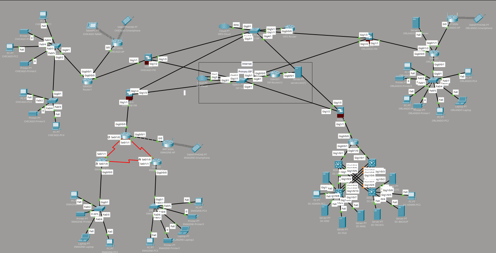

# CYB330L Enterprise Network - Cisco Packet Tracer Portfolio

A simulated 4-site enterprise network built in Cisco Packet Tracer for CYB330L (Network Routing and Switching). The original graded project covered OSPF routing, NAT, VLANs, and ASA firewall policy. After grading, I extended it with a full-mesh IPsec VPN and dual-ISP failover across all four sites.

---

## Topology Overview



```
        [EMAGINE HQ]        [Orlando]
             |                  |
    11.0.0.42/30          11.0.0.44/30
             |                  |
             +------[ISP]-------+
             |                  |
    11.0.0.46/30          11.0.0.48/30
             |                  |
        [Data Center]       [Chicago]
```

| Site | Firewall | Outside IP | ISP2 IP |
|------|----------|------------|---------|
| E-MAGINE HQ | EMAGINE-FW | 11.0.0.42 | 12.0.0.42 |
| Orlando | ORLANDO-FW | 11.0.0.44 | 12.0.0.44 |
| Data Center | DC-FW | 11.0.0.46 | 12.0.0.46 |
| Chicago | CHICAGO-FW | 11.0.0.48 | 12.0.0.48 |

Each site runs a **Cisco ASA 5506-X** firewall and an **ISR 4331** router. All four sites connect to a shared ISP router running OSPF Area 0.

---

## What's Implemented

### Original Project (graded)
- Multi-site OSPF routing (Area 0) via ISP backbone
- Per-site VLANs with inter-VLAN routing
- NAT overload (PAT) on each ASA
- ASA security policies: inside/outside zones, stateful inspection, ACLs

### Post-Grading Enhancements
- **Full-mesh IPsec VPN** - 6 site-to-site tunnels across all 4 ASAs (IKEv1, 3DES/SHA/pre-share/group2); all tunnels confirmed `QM_IDLE`
- **Dual-ISP failover** - floating static routes on every ASA (AD 1 via ISP1, AD 10 via ISP2); automatic failover when primary link drops

---

## Technologies

- **Cisco Packet Tracer** - simulation environment
- **Cisco ASA 5506-X** - edge firewall at each site
- **Cisco ISR 4331** - interior routing at each site
- **IKEv1 IPsec** - site-to-site VPN (`crypto ikev1 policy`, `tunnel-group`, `crypto map`)
- **Floating static routes** - dual-ISP redundancy without IP SLA
- **OSPF Area 0** - dynamic routing across sites
- **NAT/PAT** - internet egress on each ASA
- **ASA ACLs** - stateful security policy per interface

---

## Repository Structure

```
.
├── packet-tracer/
│   └── cyb330l-network.pkt      # Full simulation file
├── configs/
│   ├── EMAGINE-FW/
│   │   └── running-config.txt
│   ├── DC-FW/
│   │   └── running-config.txt
│   ├── ORLANDO-FW/
│   │   └── running-config.txt
│   └── CHICAGO-FW/
│       └── running-config.txt
├── diagrams/
│   └── topology.png             # Network diagram
├── docs/
│   └── network-design.md        # Detailed design notes
└── README.md
```

---

## Key Configuration Snippets

### IKEv1 Policy (same on all 4 ASAs)
```
crypto ikev1 policy 10
 encryption 3des
 hash sha
 authentication pre-share
 group 2
 lifetime 86400
```

### Dual-ISP Floating Static Routes
```
route outside 0.0.0.0 0.0.0.0 11.0.0.254 1    ! Primary ISP (AD 1)
route isp2    0.0.0.0 0.0.0.0 12.0.0.254 10   ! Backup ISP  (AD 10)
```

### Verification
```
show crypto isakmp sa    ! All 6 peers should show QM_IDLE
show route               ! Both default routes visible; primary at AD 1
```

---

## Lessons Learned / Packet Tracer Gotchas

- **PT prefix-match bug**: naming a second outside interface `outside2` causes `crypto map interface outside` to auto-complete to `outside2`. Fix: rename the nameif to `isp2`.
- **Nameif changes wipe crypto bindings**: after fixing a wrong nameif, `crypto map interface outside` and `crypto ikev1 enable outside` must be re-applied.
- **Default ACL blocks IKE**: PT applies the outside ACL to traffic destined for the ASA itself. UDP 500 must be explicitly permitted or Phase 1 never starts.
- **No twice-NAT in PT**: NAT exemption syntax (`nat (inside,outside) source static ... destination static ...`) is not supported. Skip it - tunnels function without it in the simulator.

---

## How to Open

1. Install [Cisco Packet Tracer](https://www.netacad.com/courses/packet-tracer) (free with a NetAcad account)
2. Open `packet-tracer/cyb330l-network.pkt`
3. Review device configs with `show run` on any ASA

---

*Built for CYB330L at ECPI University - San Antonio | Enhanced post-grading as a self-directed networking project*
